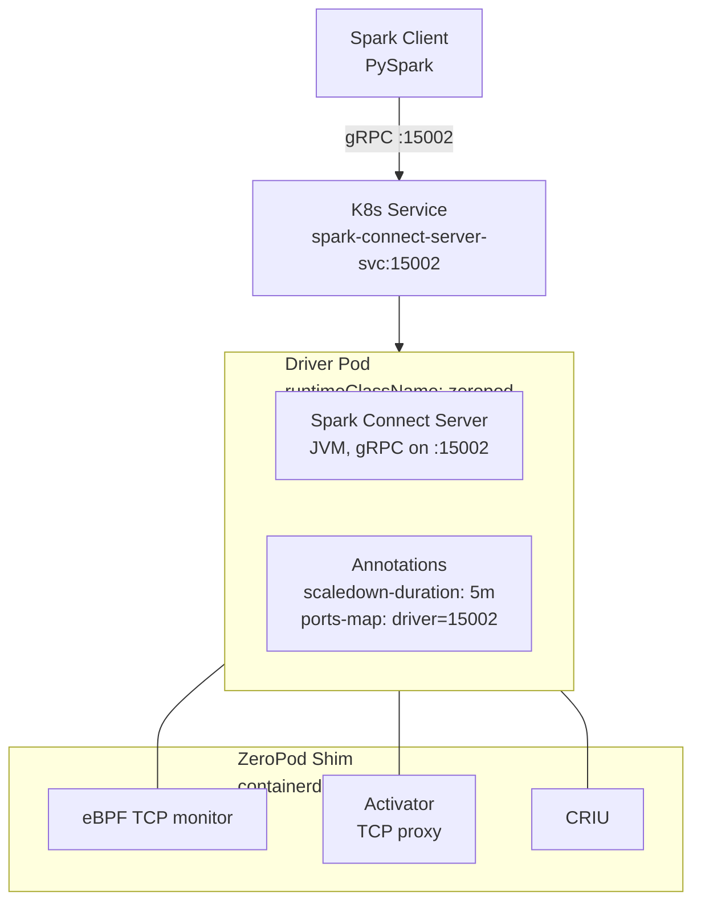
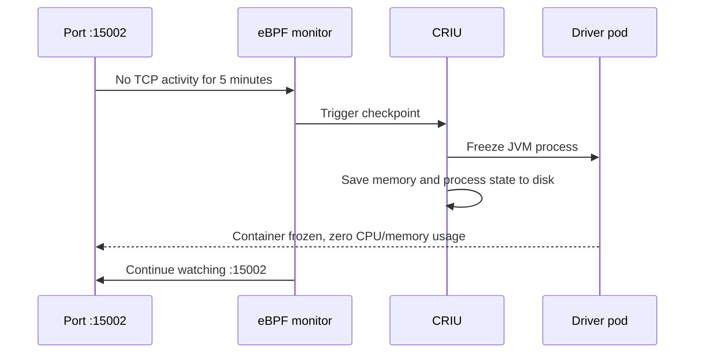
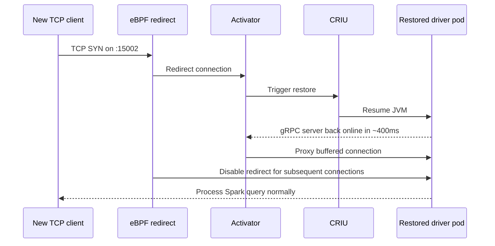
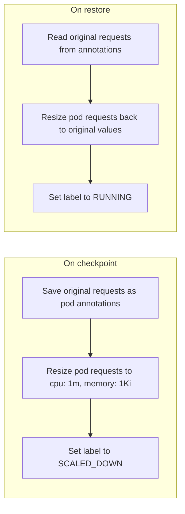
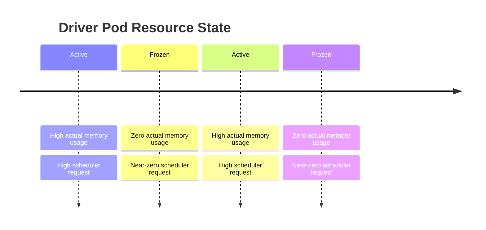
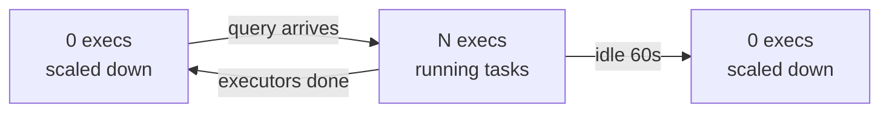

# ZeroPod + Spark Connect POC

Hibernate an idle Spark Connect driver pod using CRIU checkpoint/restore, wake it on new gRPC connections in ~400ms instead of 30-60s cold start.

## Problem

Spark Connect runs a long-lived driver pod (2-8GB RAM) that sits idle between queries. With dynamic allocation, executors scale to zero — but the driver stays running, wasting cluster resources.

| Approach | Wake time | Resources while idle |
|----------|-----------|---------------------|
| Always-on driver | 0ms | Full (2-8GB wasted) |
| KEDA scale 0→1 | 30-60s (cold start) | Zero |
| **ZeroPod (this POC)** | **~400ms** | **Near-zero (in-place resize built-in)** |

## Architecture



Idle -> Checkpoint Flow:



Wake -> Restore Flow:



In-Place Resource Resize:

ZeroPod's --in-place-scaling=true handles resource resize natively
using KEP-1287 In-Place Pod Vertical Scaling (K8s 1.33+ Beta):



Resource timeline:



## Executor Lifecycle

Spark Dynamic Allocation handles executors independently:



Executors are standard K8s pods - created and destroyed by Spark.
ZeroPod only manages the driver pod.
When driver is frozen, executors are already gone due to idle timeout.
When driver restores, new executors are requested on demand.

## Prerequisites

- Windows with Hyper-V enabled
- Minikube installed and in PATH
- Hyper-V external virtual switch named `minikube-external`
- Helm 3+
- kubectl
- Python 3 + `pip install pyspark[connect]` (for test client)

## Quick Start

```powershell
# 1. Create cluster (PowerShell as Administrator)
cd C:\Work\zeropod-spark-poc
.\scripts\setup.ps1

# 2. Install ZeroPod (WSL or PowerShell)
bash components/zeropod/install.sh

# 3. Test ZeroPod with nginx
kubectl apply -f components/zeropod/nginx-test.yaml
# Wait 30s, then curl pod IP — should checkpoint and restore

# 4. Install Spark operator
bash components/spark-operator/install.sh

# 5. Deploy Spark Connect with ZeroPod
kubectl apply -f components/spark-connect/spark-connect.yaml

# 6. Test query
kubectl port-forward svc/spark-connect-server-svc -n spark-workload 15002:15002 &
python3 components/spark-connect/test-query.py

# 7. Wait 5 min → driver checkpoints → query again → restores in ~400ms
```

## Tests

```bash
# Phase 1: ZeroPod + Spark Connect
bash tests/phase1.sh

# Run individual test
bash tests/phase1.sh 1.4    # nginx checkpoint/restore only

```

### Phase 1 Tests

| Test | Description | Duration |
|------|-------------|----------|
| 1.1 | Containerd runtime active | instant |
| 1.2 | Kernel CHECKPOINT_RESTORE enabled | instant |
| 1.3 | ZeroPod RuntimeClass registered | instant |
| 1.4 | Nginx checkpoint/restore cycle | ~50s |
| 1.5 | Spark operator ready | ~30s |
| 1.6 | Spark Connect serves queries | ~5min (first pull) |
| 1.7 | Spark Connect checkpoint/restore | ~6min (wait for idle) |

## Risk Checkpoints

Each step has a clear go/no-go:

| Step | If it fails | Fallback |
|------|-------------|----------|
| CRIU kernel check | Kernel lacks CONFIG_CHECKPOINT_RESTORE | Custom minikube ISO |
| Nginx CRIU test | ZeroPod can't checkpoint on this kernel | Different VM/kernel |
| Spark + ZeroPod | CRIU fails on JVM (sockets/threads) | Try CRaC or KEDA |
| In-place resize | Resize triggers restart on frozen pod | Resize before checkpoint |

## Project Structure

```
zeropod-spark-poc/
├── scripts/
│   ├── common.ps1              # Config + IPv6 fix (test-first)
│   ├── setup.ps1               # Create cluster (Hyper-V + containerd)
│   ├── start.ps1               # Start + re-apply fixes
│   └── destroy.ps1             # Teardown
├── components/
│   ├── zeropod/
│   │   ├── install.sh          # ZeroPod via kustomize
│   │   └── nginx-test.yaml     # Smoke test
│   ├── spark-operator/
│   │   └── install.sh          # Apache Spark operator via Helm
│   ├── spark-connect/
│   │   ├── spark-connect.yaml  # SparkApplication + ZeroPod annotations
│   │   └── test-query.py       # PySpark test client
└── tests/
    └── phase1.sh               # 7 tests
```

## Key Decisions

- **containerd** runtime (not Docker) — ZeroPod is a containerd shim
- **Single node** minikube — sufficient for POC, minimizes resource needs
- **Apache Spark operator** — already have SparkApplication manifests
- **Spark 4.1.1** — latest with Spark Connect support
- **5 min idle timeout** for testing (30 min in production)
- **No custom controller needed** — ZeroPod's `--in-place-scaling=true` handles resource resize natively via KEP-1287
